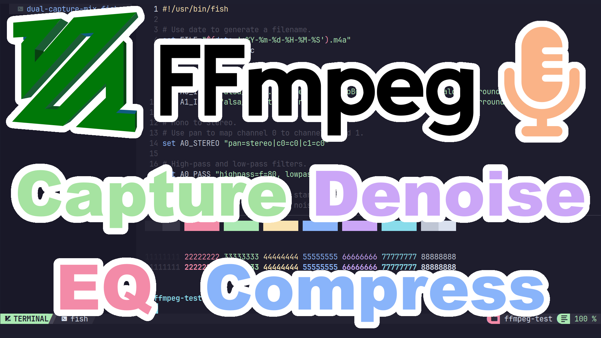
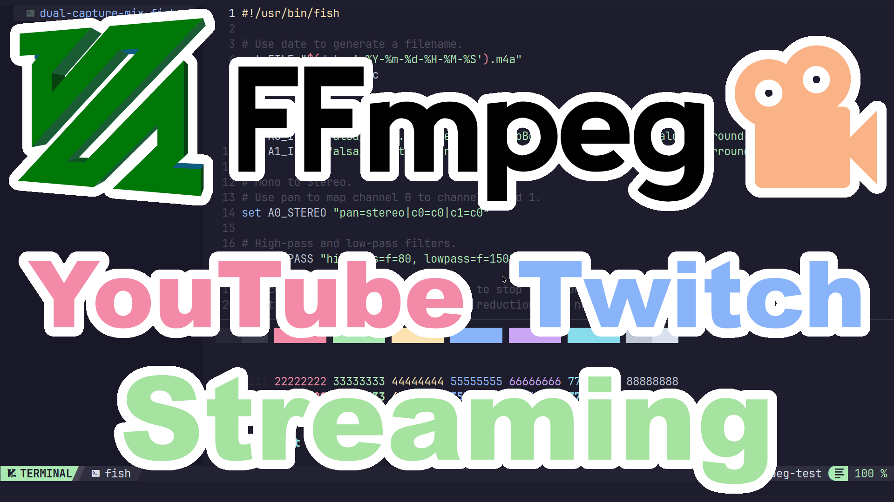

# FFmpeg
These are bash and fish example scripts for capturing a mic, mic and system sound, or mic and system sound and system video. There is also examples for streaming for both software and AMD hardware.
